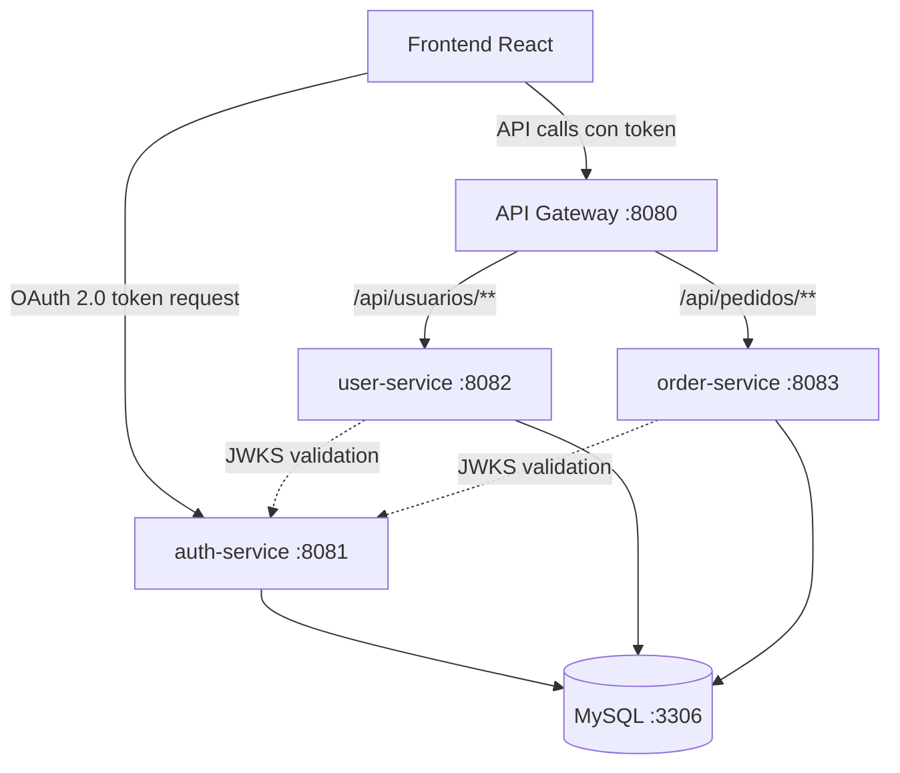

# 🚚 Backend de Seguimiento de Pedidos con Microservicios (OAuth 2.0)

Este repositorio contiene la implementación del backend para un sistema de seguimiento de pedidos y rutas, construido sobre una arquitectura de **microservicios** con **Spring Boot**, **API Gateway** y **OAuth 2.0** (Spring Authorization Server). El frontend (React + Vite) se comunica exclusivamente con el API Gateway, que redirige las peticiones a los servicios correspondientes. La autenticación y autorización siguen el estándar OAuth 2.0 con JWT.

## 📌 Tabla de Contenidos

- [Arquitectura](#-arquitectura)
- [Tecnologías utilizadas](#-tecnologías-utilizadas)
- [Requisitos previos](#-requisitos-previos)
- [Estructura del proyecto](#-estructura-del-proyecto)
- [Instrucciones de ejecución local (con Docker)](#-instrucciones-de-ejecución-local-con-docker)
- [Pruebas con Postman](#-pruebas-con-postman)
- [Despliegue en Render](#-despliegue-en-render)
- [Diagrama de arquitectura](#-diagrama-de-arquitectura)
- [Contribuciones y flujo de trabajo en GitHub](#-contribuciones-y-flujo-de-trabajo-en-github)
- [Evidencias de pruebas](#-evidencias-de-pruebas)
- [Buenas prácticas aplicadas](#-buenas-prácticas-aplicadas)

---

## 🏗️ Arquitectura

El sistema sigue el estilo **cliente-servidor** y se compone de los siguientes microservicios, cada uno ejecutándose en su propio contenedor Docker. La seguridad se basa en **OAuth 2.0** con tokens JWT firmados mediante RSA (par de llaves pública/privada).

| Servicio | Puerto interno | Rol OAuth 2.0 | Descripción |
|----------|----------------|---------------|-------------|
| **auth-service** | 8081 | Authorization Server | Emite tokens JWT tras autenticar al cliente (frontend) mediante el flujo `client_credentials` o `authorization_code`. Expone endpoints `/oauth2/token`, `/.well-known/jwks.json`. |
| **user-service** | 8082 | Resource Server | Gestiona usuarios y roles. Valida cada petición verificando el JWT contra el Authorization Server (vía `issuer-uri`). |
| **order-service** | 8083 | Resource Server | Gestiona pedidos, historial y ubicaciones. También valida JWT como Resource Server. |
| **api-gateway** | 8080 | Cliente OAuth 2.0 | Actúa como punto único de entrada. Se registra en `auth-service` como cliente (client-id y client-secret). Redirige peticiones y propaga el token. |
| **mysql-db** | 3306 | — | Base de datos compartida (MySQL 8). Las tablas se crean automáticamente mediante Hibernate. |

**Flujo de autenticación**:

1. El frontend solicita un token a `/oauth2/token` del `auth-service` (con client-id y client-secret).
2. El `auth-service` valida las credenciales y devuelve un JWT firmado con su clave privada.
3. El frontend incluye el token en cada petición al API Gateway (header `Authorization: Bearer <token>`).
4. El gateway reenvía la petición al microservicio correspondiente.
5. `user-service` y `order-service` (Resource Servers) validan el token automáticamente: consultan el endpoint `/.well-known/jwks.json` del `auth-service` para obtener la clave pública y verificar la firma. No comparten secreto simétrico.

---

## 🧰 Tecnologías utilizadas

- **Java ver >= 17**
- **Spring Boot 4.0.x**
- **Spring Authorization Server** (para `auth-service`)
- **Spring Cloud Gateway** (API Gateway reactivo)
- **Spring Security OAuth2 Resource Server** (para `user-service` y `order-service`)
- **Spring Data JPA (Hibernate)**
- **MySQL 8**
- **Maven**
- **Docker & Docker Compose**
- **Postman** (pruebas de API)
- **Git / GitHub**

---

## 📋 Requisitos previos

- **Java 17 or higher** (Open JDK)
- **Maven** (o usar `./mvnw`)
- **Docker Desktop** (con integración WSL2 en Windows) o Docker Engine + Compose
- **Git**

---

## 📁 Estructura del proyecto

```
back_end/
├── auth-service/                 # Emisor de JWT (autenticación)
│   ├── src/main/java/auth/
│   │   ├── controller/           # Endpoints públicos: POST /auth/login, POST /auth/register (opcional)
│   │   ├── service/              # Lógica de negocio: AuthService (validar credenciales), JwtService (generar/validar tokens), UserDetailsService (cargar usuario)
│   │   ├── repository/           # JPA repositorios: PersonaRepository (CRUD y consultas por email)
│   │   ├── entity/               # Entidades JPA: Persona (id, email, password, rol, nombre, apellido, etc.)
│   │   ├── dto/                  # Data Transfer Objects: LoginRequestDTO, LoginResponseDTO, RegisterRequestDTO (para no exponer entidades)
│   │   ├── config/               # Clases de configuración: SecurityConfig (filtros, password encoder, rutas públicas), JwtAuthenticationFilter (intercepta y valida tokens en peticiones entrantes, aunque auth no necesita muchas)
│   │   └── exception/            # Manejador global de excepciones: GlobalExceptionHandler (devuelve errores HTTP legibles, ej. 401, 400)
│   ├── Dockerfile                # Instrucciones para construir la imagen Docker del auth-service
│   └── pom.xml                   # Dependencias Maven: Spring Boot Starter Web, Security, Data JPA, MySQL Connector, JJWT, etc.
│
├── user-service/                 # Resource Server (gestión de usuarios)
│   ├── src/main/java/user/
│   │   ├── controller/           # Endpoints protegidos: CRUD de usuarios (/api/usuarios), cambio de roles, etc.
│   │   ├── service/              # Lógica de negocio: UsuarioService (crear, actualizar, eliminar, listar, asignar roles)
│   │   ├── repository/           # PersonaRepository (acceso a base de datos de usuarios)
│   │   ├── entity/               # Persona (puede tener más campos que la de auth, pero misma tabla compartida)
│   │   ├── dto/                  # UsuarioRequestDTO (para crear/actualizar), UsuarioResponseDTO (para devolver datos sin password)
│   │   ├── config/               # SecurityConfig: configurado como OAuth2 Resource Server con JWT (valida tokens usando la misma clave secreta o issuer-uri)
│   │   └── exception/            # GlobalExceptionHandler (errores específicos, ej. 404 usuario no encontrado, 409 conflicto)
│   ├── Dockerfile
│   └── pom.xml                   # Dependencias: Spring Boot Starter Web, Security, OAuth2 Resource Server, Data JPA, MySQL Connector
│
├── order-service/                # Resource Server (pedidos, historial, ubicaciones)
│   ├── src/main/java/order/
│   │   ├── controller/           # Endpoints protegidos: CRUD de pedidos, cambiar estado, asignar repartidor, registrar ubicación, consultar historial
│   │   ├── service/              # PedidoService, HistorialService (lógica de negocio de pedidos, optimistic locking, transacciones)
│   │   ├── repository/           # PedidoRepository, HistorialRepository, UbicacionRepository (JPA)
│   │   ├── entity/               # Pedido (con @Version), HistorialMovimiento, Ubicacion, EstadoPedido (enum)
│   │   ├── dto/                  # PedidoRequestDTO, PedidoResponseDTO, HistorialDTO, UbicacionDTO, AsignacionDTO
│   │   ├── config/               # SecurityConfig: Resource Server JWT (misma configuración que user-service)
│   │   └── exception/            # GlobalExceptionHandler (OptimisticLockException → 409, etc.)
│   ├── Dockerfile
│   └── pom.xml                   # Mismas dependencias que user-service
│
├── api-gateway/                  # Punto único de entrada (Spring Cloud Gateway)
│   ├── src/main/java/gateway/
│   │   ├── config/               # GatewayConfig: define rutas (/auth/** → auth-service, /api/usuarios/** → user-service, /api/pedidos/** → order-service), timeouts, CORS, filtros (logs, etc.)
│   │   └── filter/               # (Opcional) Filtros personalizados, por ejemplo para registrar cada petición o añuir headers
│   ├── Dockerfile
│   └── pom.xml                   # Dependencias: Spring Cloud Gateway (no incluye Spring Web, son incompatibles)
│
├── docker-compose.yml            # Orquestación de todos los contenedores: mysql-db, auth-service, user-service, order-service, api-gateway. Define red interna, volúmenes, variables de entorno.
├── .gitignore                    # Archivos y carpetas ignoradas por Git: target/, .idea/, .DS_Store, application-secrets.yml, etc.
└── README.md                     # Documentación del proyecto: arquitectura, instrucciones de ejecución, pruebas con Postman, diagrama, etc.
```

Cada microservicio sigue el patrón Controller → Service → Repository → Entity, utilizando DTOs para la comunicación con el exterior.

---

## 🚀 Instrucciones de ejecución local (con Docker)

1. **Clonar el repositorio**
   ```bash
   git clone git@github.com:tu-usuario/back_end.git
   cd back_end
   ```

2. **Construir los JAR de cada servicio** (opcional, los Dockerfiles pueden hacer multi‑stage)
   ```bash
   cd auth-service && ./mvnw clean package && cd ..
   cd user-service && ./mvnw clean package && cd ..
   cd order-service && ./mvnw clean package && cd ..
   cd api-gateway && ./mvnw clean package && cd ..
   ```

3. **Levantar todos los contenedores**
   ```bash
   docker compose up --build
   ```
   Este comando levanta los cinco contenedores, crea una red interna y expone los puertos:
   - Gateway: `8080`
   - auth-service: `8081`
   - user-service: `8082`
   - order-service: `8083`
   - MySQL: `3306`

4. **Verificar el estado**
   ```bash
   docker compose ps
   ```

5. **Obtener un token JWT** (para probar desde Postman)
   - El Authorization Server expone el endpoint:
     ```
     POST http://localhost:8081/oauth2/token
     ```
   - Utiliza autenticación **Basic Auth** (client-id / client-secret) definida en la configuración de `auth-service`.
   - Envía el parámetro `grant_type=client_credentials`.

   Respuesta:
   ```json
   {
     "access_token": "eyJraWQ...",
     "token_type": "Bearer",
     "expires_in": 3599
   }
   ```

6. **Acceder a los recursos protegidos**
   - Incluye el token en el header: `Authorization: Bearer <access_token>`
   - Ejemplo: `GET http://localhost:8080/api/usuarios`

Para detener los contenedores:
```bash
docker compose down
```

---

## 🧪 Pruebas con Postman

Se incluye una colección actualizada en la raíz: `PedidosTracking_OAuth2.postman_collection.json`. El flujo de pruebas es:

1. **Solicitar token** (sin necesidad de usuario/contraseña previo, se usa client credentials).
2. **Usar token** para invocar endpoints de `user-service` y `order-service` a través del gateway.

### Solicitud de token (Authorization Server)

- **URL**: `http://localhost:8081/oauth2/token`
- **Método**: POST
- **Auth**: Basic Auth con `client-id` y `client-secret` (ej. `cliente-web` / `secreto-web`).
- **Body**: `x-www-form-urlencoded` con `grant_type=client_credentials`.
- **Respuesta**: contiene `access_token`. Copiar el token.

### Llamada a un endpoint protegido (Resource Server)

- **URL**: `http://localhost:8080/api/pedidos` (pasa por el gateway)
- **Método**: GET
- **Headers**: `Authorization: Bearer <token>`

Esperar respuesta `200 OK` con lista de pedidos (vacía al principio).

### Validación de errores

- Token inválido o ausente → `401 Unauthorized`
- Token expirado → `401 Unauthorized`
- Rol insuficiente (si se implementa) → `403 Forbidden`

Los tiempos de respuesta se mantienen por debajo de 2 segundos (RNF4) gracias a la validación local de JWT en los Resource Servers (sin llamadas al Authorization Server en cada petición).

---

## ☁️ Despliegue en Render

Render permite desplegar un `docker-compose.yml` como Blueprint. Pasos:

1. Subir el repositorio a GitHub.
2. En Render, crear un nuevo **Blueprint** y conectar el repo.
3. Asegurarse de configurar las siguientes variables de entorno:
   - `JWT_PRIVATE_KEY` y `JWT_PUBLIC_KEY` (pueden generarse con OpenSSL).
   - `CLIENT_ID`, `CLIENT_SECRET` (para el cliente OAuth del gateway).
4. Render construirá y levantará los contenedores automáticamente.
5. Actualizar el frontend para que apunte a la URL pública de Render (puerto 8080).

> **Nota**: Para entornos de producción, se recomienda usar una base de datos externa (ej. Clever Cloud) en lugar del volumen efímero de Docker.

---

## 📐 Diagrama de arquitectura



Las líneas punteadas indican que los Resource Servers consultan el endpoint `/.well-known/jwks.json` del Authorization Server al iniciar (y periódicamente) para obtener la clave pública.

---

## 👥 Contribuciones y flujo de trabajo en GitHub

- La rama `main` está protegida mediante **Rulesets**.
- No se permite push directo a `main`; todo cambio debe realizarse mediante **Pull Requests** con al menos 1 aprobación.
- Las conversaciones deben resolverse antes de fusionar.

Flujo recomendado:
```bash
git checkout main
git pull origin main
git checkout -b feature/nombre
... (commits)
git push --set-upstream origin feature/nombre
```
Luego abrir Pull Request en GitHub.

---

## 📸 Evidencias de pruebas

Las capturas de pantalla de las pruebas con Postman se encuentran en la carpeta `/docs`:

- `postman-token-request.png` – Solicitud de token exitosa.
- `postman-listar-pedidos.png` – Listado de pedidos con token válido.
- `postman-error-401.png` – Token inválido.
- `postman-error-409.png` – Conflicto por optimistic locking.

También se incluye el archivo de colección exportado `PedidosTracking_OAuth2.postman_collection.json`.

---

## 🧠 Buenas prácticas aplicadas

- **Estándar OAuth 2.0** – Authorization Server y Resource Servores claramente separados.
- **Validación de tokens sin estado** – Los Resource Servers validan localmente mediante clave pública.
- **API Gateway como cliente OAuth** – Centraliza la obtención del token (si el frontend no lo hace directamente).
- **Optimistic locking** (`@Version`) en entidades `Pedido`.
- **Contenerización** con Docker Compose.
- **Manejo global de excepciones** (`@RestControllerAdvice`).
- **Uso de DTOs** para no exponer entidades JPA.

---

## 📄 Licencia

Proyecto académico – Universidad Militar Nueva Granada. Sin fines comerciales.

---

## ✒️ Autores

- Jorge Enrique Celis Cortés
- Liner Fabian Candia Marin
- Miguel Eduardo Parra Amador
- Santiago Andres Diaz Peña
