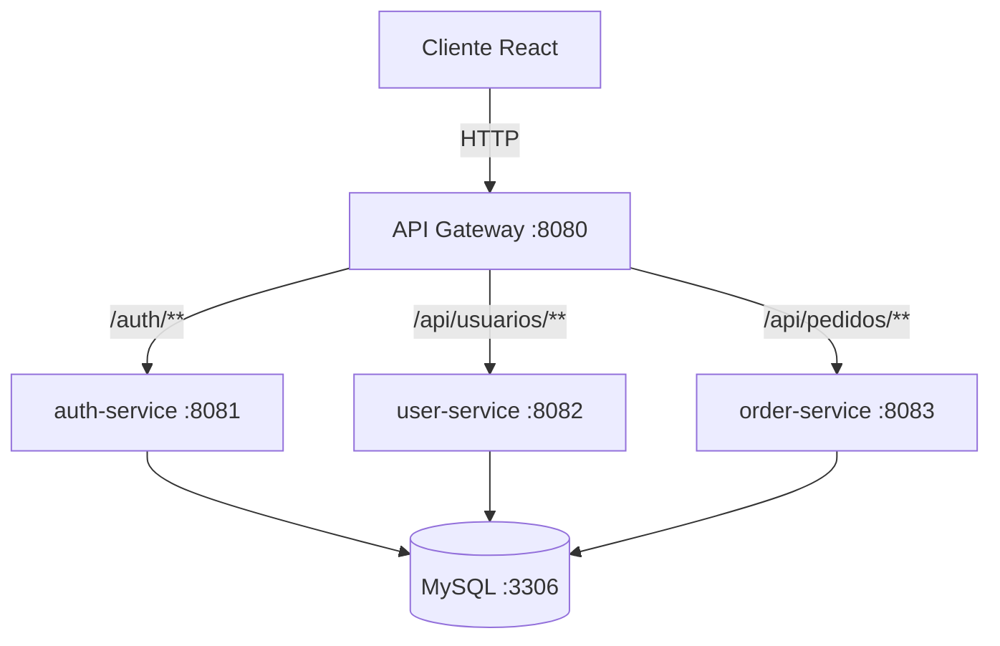

# 🚚 Backend de Seguimiento de Pedidos con Microservicios

Este repositorio contiene la implementación del backend para un sistema de seguimiento de pedidos y rutas, construido sobre una arquitectura de **microservicios** con **Spring Boot**, **API Gateway**, **JWT** para autenticación y **Docker Compose** para orquestación. El frontend (React + Vite) se comunica exclusivamente con el API Gateway, que redirige las peticiones a los servicios correspondientes.

## 📌 Tabla de Contenidos

- [Arquitectura](#arquitectura)
- [Tecnologías utilizadas](#tecnologías-utilizadas)
- [Requisitos previos](#requisitos-previos)
- [Estructura del proyecto](#estructura-del-proyecto)
- [Instrucciones de ejecución local (con Docker)](#instrucciones-de-ejecución-local-con-docker)
- [Pruebas con Postman](#pruebas-con-postman)
- [Despliegue en Render](#despliegue-en-render)
- [Diagrama de arquitectura](#diagrama-de-arquitectura)
- [Contribuciones y flujo de trabajo en GitHub](#contribuciones-y-flujo-de-trabajo-en-github)
- [Evidencias de pruebas](#evidencias-de-pruebas)

---

## 🏗️ Arquitectura

El sistema sigue el estilo **cliente-servidor** y se compone de los siguientes microservicios, cada uno ejecutándose en su propio contenedor Docker:

| Servicio | Puerto interno | Descripción |
|----------|----------------|-------------|
| **auth-service** | 8081 | Registro, login y emisión de tokens JWT. Almacena usuarios (tabla `personas`). |
| **user-service** | 8082 | CRUD de usuarios y gestión de roles (administrador, operador, repartidor, cliente). |
| **order-service** | 8083 | Gestión de pedidos, historial de movimientos, asignación de repartidores y ubicaciones. |
| **api-gateway** | 8080 | Punto único de entrada. Enruta `/auth/**` → auth-service, `/api/usuarios/**` → user-service, `/api/pedidos/**` → order-service. |
| **mysql-db** | 3306 | Base de datos relacional compartida (MySQL). Las tablas son creadas automáticamente por Hibernate. |

La comunicación entre servicios es **síncrona vía HTTP** a través del API Gateway. La autenticación se realiza mediante JWT: el `auth-service` emite el token y los demás servicios (user, order) lo validan localmente usando la misma clave secreta, sin llamadas adicionales.

---

## 🧰 Tecnologías utilizadas

- Java 17
- Spring Boot 3.1.x
- Spring MVC (REST Controllers)
- Spring Data JPA (Hibernate)
- Spring Security + JWT (JJWT)
- Spring Cloud Gateway
- MySQL 8
- Maven
- Docker & Docker Compose
- Postman (pruebas de API)
- Git / GitHub (control de versiones)

---

## 📋 Requisitos previos

Asegúrate de tener instalado en tu máquina:

- **Java 17** (JDK)
- **Maven** (opcional, porque puedes usar el wrapper `./mvnw`)
- **Docker Desktop** (o Docker Engine + Docker Compose)
- **Git** (para clonar el repositorio)

---

## 📁 Estructura del proyecto

```
back_end/
├── auth-service/           # Microservicio de autenticación
├── user-service/           # Microservicio de gestión de usuarios
├── order-service/          # Microservicio de pedidos y seguimiento
├── api-gateway/            # API Gateway con Spring Cloud Gateway
├── docker-compose.yml      # Orquestación de todos los contenedores
├── .gitignore
└── README.md
```

Cada microservicio tiene su propio `pom.xml`, `Dockerfile` y código organizado en los paquetes: `controller`, `service`, `repository`, `entity`, `dto`, `config`, `exception`.

---

## 🚀 Instrucciones de ejecución local (con Docker)

Sigue estos pasos para levantar todo el sistema en tu máquina:

1. **Clona el repositorio**
   ```bash
   git clone https://github.com/tu-usuario/backend-pedidos-microservices.git
   cd backend-pedidos-microservices
   ```

2. **Construye los JAR de cada servicio** (opcional, Docker Compose puede hacerlo automáticamente si usas multi-stage)
   ```bash
   cd auth-service && ./mvnw clean package && cd ..
   cd user-service && ./mvnw clean package && cd ..
   cd order-service && ./mvnw clean package && cd ..
   cd api-gateway && ./mvnw clean package && cd ..
   ```

3. **Levanta todos los contenedores con Docker Compose**
   ```bash
   docker-compose up --build
   ```
   Este comando:
   - Descarga la imagen de MySQL.
   - Construye las imágenes de cada microservicio (usando sus Dockerfiles).
   - Levanta los cinco contenedores y los conecta a la misma red interna.
   - Expone los puertos: Gateway `8080`, auth `8081`, user `8082`, order `8083`, MySQL `3306`.

4. **Verifica que todos los servicios estén corriendo**
   ```bash
   docker-compose ps
   ```
   Deberías ver 5 contenedores con estado `Up`.

5. **Accede a la aplicación**
   - El frontend (React) debe estar configurado para apuntar a `http://localhost:8080`.
   - Puedes probar directamente los endpoints con Postman (ver sección siguiente).

Para detener todos los contenedores:
```bash
docker-compose down
```

---

## 🧪 Pruebas con Postman


Incluimos una colección de Postman exportada (`PedidosTracking.postman_collection.json`) en la raíz del repositorio. Puedes importarla y probar los siguientes flujos:

### 1. Registro de usuario
- `POST http://localhost:8080/auth/register`
- Body JSON:
  ```json
  {
    "email": "admin@example.com",
    "password": "123456",
    "nombre": "Admin",
    "apellido": "Principal",
    "rol": "ADMIN"
  }
  ```

### 2. Inicio de sesión (obtener JWT)
- `POST http://localhost:8080/auth/login`
- Body: `{ "email": "admin@example.com", "password": "123456" }`
- Respuesta incluye un `token`. Copia ese token.

### 3. Peticiones autenticadas
En Postman, añade el header:
```
Authorization: Bearer <token>
```

#### Crear un pedido
- `POST http://localhost:8080/api/pedidos`
- Body:
  ```json
  {
    "origen": "Calle 123",
    "destino": "Carrera 45",
    "descripcion": "Laptop",
    "clienteId": 1
  }
  ```

#### Listar pedidos
- `GET http://localhost:8080/api/pedidos`

#### Cambiar estado del pedido
- `PUT http://localhost:8080/api/pedidos/{id}/estado?nuevoEstado=ASIGNADO`

#### Asignar repartidor
- `PUT http://localhost:8080/api/pedidos/{id}/asignar?repartidorId=2`

#### Consultar historial
- `GET http://localhost:8080/api/pedidos/{id}/historial`

### 4. Pruebas de error
- Intentar acceder sin token → `401 Unauthorized`
- Usuario con rol `REPARTIDOR` tratando de eliminar un pedido → `403 Forbidden`
- Pedido inexistente → `404 Not Found`

> **Medición de tiempos**: Verifica que cada respuesta llegue en menos de 2 segundos (requerimiento no funcional RNF4). En Postman, el tiempo aparece junto al código de estado.

---

## ☁️ Despliegue en Render

Render soporta `docker-compose.yml` de forma nativa. Sigue estos pasos:

1. Crea una cuenta en [Render.com](https://render.com).
2. Conecta tu repositorio de GitHub.
3. Crea un nuevo **Blueprint** (Web Service) y selecciona el repositorio.
4. Render detectará automáticamente el `docker-compose.yml` y te permitirá asignar variables de entorno.
5. Configura las siguientes variables de entorno (necesarias para los perfiles Docker):
   - `DB_USER=root`
   - `DB_PASSWORD=rootpass` (cámbiala por una segura)
   - `JWT_SECRET` (una clave larga y aleatoria)
6. Render levantará los contenedores y te asignará una URL pública (ej. `https://tu-app.onrender.com`).
7. Actualiza el frontend para que apunte a esa URL en lugar de `localhost`.

**Nota**: Asegúrate de que la base de datos MySQL no esté en un volumen efímero; puedes usar el servicio de base de datos administrado de Render o conectar una externa (Clever Cloud, Railway, etc.).

---

## 📐 Diagrama de arquitectura



*Diagrama creado con Mermaid. También puedes incluir una imagen en formato PNG en la carpeta `/docs`.*

---

## 👥 Contribuciones y flujo de trabajo en GitHub

Para mantener la calidad del código, hemos configurado protección en la rama `main`:

- **No se permite push directo** a `main`.
- Todos los cambios deben hacerse mediante **Pull Requests** (PR).
- Cada PR necesita al menos **1 aprobación** de otro miembro del equipo antes de fusionarse.

Flujo recomendado:
1. Crear una rama desde `main`: `git checkout -b feature/nueva-funcionalidad`
2. Hacer commits y push: `git push --set-upstream origin feature/...`
3. Abrir un Pull Request en GitHub.
4. Solicitar revisión a un compañero.
5. Después de la aprobación y de pasar los chequeos (si los hay), fusionar el PR.
6. Eliminar la rama remota.

---

## 📸 Evidencias de pruebas

En la carpeta `/docs` se encuentran capturas de pantalla de las pruebas realizadas con Postman:

- `postman-registro.png` – Registro exitoso.
- `postman-login.png` – Login con token devuelto.
- `postman-crear-pedido.png` – Creación de pedido con status 201.
- `postman-listar-pedidos.png` – Listado de pedidos con tiempos de respuesta <2s.
- `postman-error-401.png` – Intento de acceso sin token (401).
- `postman-error-409.png` – Conflicto por optimistic locking (cuando dos operadores editan el mismo pedido).

Además, se incluye el archivo de la colección exportada: `PedidosTracking.postman_collection.json`.

---

## 🧠 Aprendizajes y buenas prácticas aplicadas

- **Separación de responsabilidades** mediante microservicios.
- **API Gateway** como punto único de entrada, ocultando la topología interna.
- **Autenticación stateless con JWT** – cada servicio valida el token localmente.
- **Optimistic locking** (`@Version`) para evitar actualizaciones perdidas en pedidos.
- **Contenerización** con Docker Compose para entornos reproducibles.
- **Manejo global de excepciones** (`@RestControllerAdvice`) para respuestas HTTP limpias.
- **Uso de DTOs** para no exponer las entidades JPA directamente.

---

## 📄 Licencia

Este proyecto es de uso académico como parte de la asignatura de Ingeniería Web. Puede ser utilizado como base para proyectos similares.

---

## ✒️ Autores

- Jorge Enrique Celis Cortés
- Liner Fabian Candia Marin
- Miguel Eduardo Parra Amador
- Santiago Andres Diaz Peña

---
