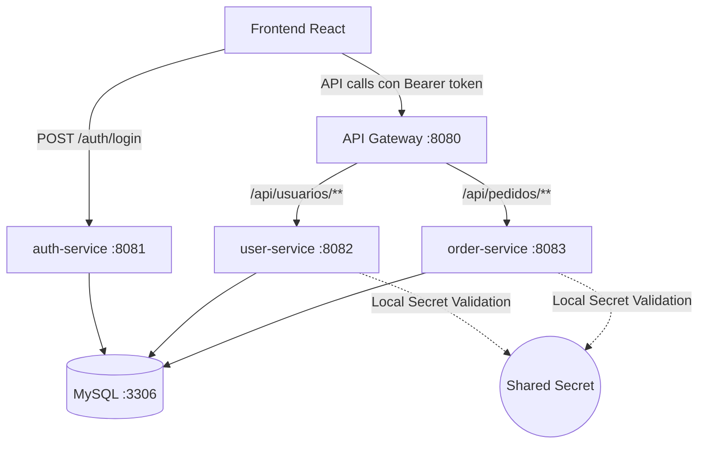

# 🚚 Backend de Seguimiento de Pedidos con Microservicios

Este repositorio contiene la implementación del backend para un sistema de seguimiento de pedidos y rutas, construido sobre una arquitectura de **microservicios** con **Spring Boot** y **API Gateway**. El frontend (React + Vite) se comunica exclusivamente con el API Gateway, que redirige las peticiones a los servicios correspondientes. La autenticación se basa en **JWT (JSON Web Tokens)** personalizados con firma HMAC-SHA256.

## 📌 Tabla de Contenidos

- [Arquitectura](#-arquitectura)
- [Tecnologías utilizadas](#-tecnologías-utilizadas)
- [Requisitos previos](#-requisitos-previos)
- [Estructura del proyecto](#-estructura-del-proyecto)
- [Instrucciones de ejecución local (con Docker)](#-instrucciones-de-ejecución-local-con-docker)
- [Pruebas con Postman](#-pruebas-con-postman)
- [Despliegue en Render](#-despliegue-en-render)
- [Diagrama de arquitectura](#-diagrama-de-arquitectura)
- [Contribuciones y flujo de trabajo en GitHub](#-contribuciones-y-flujo-de-trabajo-en-github)
- [Evidencias de pruebas](#-evidencias-de-pruebas)
- [Buenas prácticas aplicadas](#-buenas-prácticas-aplicadas)

---

## 🏗️ Arquitectura

El sistema sigue el estilo **cliente-servidor** y se compone de los siguientes microservicios, cada uno ejecutándose en su propio contenedor Docker. La seguridad se basa en **JWT custom** firmado con HMAC-SHA256, utilizando una clave secreta compartida.

| Servicio | Puerto interno | Rol Seguridad | Descripción |
|----------|----------------|---------------|-------------|
| **auth-service** | 8081 | Emisor JWT | Emite tokens JWT tras autenticar al usuario (email/password). Expone endpoints `/auth/login` y `/auth/register`. |
| **user-service** | 8082 | Resource Server | Gestiona usuarios y roles. Valida cada petición verificando la firma del JWT localmente con la clave secreta compartida. |
| **order-service** | 8083 | Resource Server | Gestiona pedidos, historial y ubicaciones. También valida JWT localmente como Resource Server. |
| **api-gateway** | 8080 | API Gateway | Actúa como punto único de entrada. Redirige peticiones y propaga el token JWT sin validarlo (la validación ocurre en los servicios). |
| **mysql-db** | 3306 | — | Base de datos compartida (MySQL 8). Las tablas se crean automáticamente mediante Hibernate. |

**Flujo de autenticación**:

1. El frontend envía credenciales (email y password) al endpoint `/auth/login` del `auth-service`.
2. El `auth-service` valida las credenciales contra la base de datos y devuelve un JWT firmado con su clave secreta HMAC-SHA256. El token incluye un identificador único (`jti`) para permitir su revocación individual.
3. El frontend incluye el token en cada petición al API Gateway (header `Authorization: Bearer <token>`).
4. El gateway reenvía la petición al microservicio correspondiente.
5. `user-service` y `order-service` validan el token automáticamente verificando la firma con la misma clave secreta (sin consultar al `auth-service`).
6. Al cerrar sesión, el frontend envía `POST /auth/logout` con el token. El `auth-service` registra el `jti` en la tabla `token_blacklist` — el token queda revocado de inmediato aunque aún no haya expirado.

**Duración de los tokens**: 8 horas desde el login. Pueden invalidarse antes haciendo logout.

---
### Base de datos compartida (simplificación académica)

Aunque en una arquitectura de microservicios pura cada servicio debería tener su propia base de datos, por razones de simplicidad y tiempo usamos una única instancia MySQL. **Cada servicio accede solo a sus tablas**:
- `auth-service` → tablas `personas`, `repartidores`, `operadores_logisticos`, `token_blacklist`.
- `user-service` → tabla `personas` (gestión completa de usuarios).
- `order-service` → tablas `pedidos`, `historial_movimiento`, `ubicaciones`.

No se utilizan **triggers** ni sincronización a nivel de base de datos. Si un servicio necesita datos de otro (ej. `order-service` necesita el nombre del cliente), se hará mediante llamada a la API de `user-service` o se mantendrá una copia desnormalizada gestionada por eventos.

### Esquema de base de datos

El modelo usa una tabla principal `personas` con **tablas de extensión** para los roles que tienen datos propios adicionales:

```
personas  (todos los usuarios)
├── id             BIGINT PK AUTO_INCREMENT
├── nombre         VARCHAR(255) NOT NULL
├── apellido       VARCHAR(255)
├── email          VARCHAR(255) UNIQUE NOT NULL
├── password       VARCHAR(255) NOT NULL  ← BCrypt hash
└── rol            VARCHAR(255) NOT NULL  ← ADMINISTRADOR | OPERADOR_LOGISTICO | REPARTIDOR | CLIENTE

repartidores  (extensión — solo repartidores)
├── persona_id     BIGINT PK FK → personas.id
├── capacidad      INT NOT NULL
└── disponibilidad BOOLEAN NOT NULL DEFAULT true

operadores_logisticos  (extensión — solo operadores)
├── persona_id     BIGINT PK FK → personas.id
└── admin_id       BIGINT FK → personas.id  ← admin que supervisa al operador

token_blacklist  (tokens revocados por logout)
├── jti            VARCHAR(36) PK  ← UUID único del JWT
└── expires_at     DATETIME NOT NULL
```

Hibernate genera y actualiza estas tablas automáticamente (`ddl-auto: update`) al arrancar cada servicio.

---

## 🧰 Tecnologías utilizadas

- **Java ver >= 17**
- **Spring Boot 4.0.x**
- **Spring Security & JJWT 0.12.x** (para autenticación JWT)
- **Spring Cloud Gateway** (API Gateway reactivo)
- **Spring Data JPA (Hibernate)**
- **MySQL 8**
- **Maven**
- **Docker & Docker Compose**
- **Postman** (pruebas de API)
- **Git / GitHub**

---

## 📋 Requisitos previos

- **Java 17 or higher** (Open JDK)
- **Maven** (o usar `./mvnw`)
- **Docker Desktop** (con integración WSL2 en Windows) o Docker Engine + Compose
- **Git**

---

## 📁 Estructura del proyecto

```
back_end/
├── auth-service/                 # Emisor de JWT (autenticación)
│   ├── src/main/java/auth/
│   │   ├── controller/           # Endpoints públicos: POST /auth/login, POST /auth/register, POST /auth/logout
│   │   ├── service/              # Lógica de negocio: AuthService, JwtService, CustomUserDetailsService
│   │   ├── repository/           # PersonaRepository, RepartidorRepository, OperadorLogisticoRepository, TokenBlacklistRepository
│   │   ├── entity/               # Persona, Repartidor, OperadorLogistico, enum Rol, TokenBlacklist
│   │   ├── dto/                  # DTOs: LoginRequest, LoginResponse, RegisterRequest
│   │   ├── config/               # SecurityConfig, JwtAuthenticationFilter (verifica blacklist)
│   │   ├── scheduled/            # TokenCleanupTask: limpieza automática de tokens expirados (cada hora)
│   │   └── exception/            # GlobalExceptionHandler (401, 409, 500)
│   ├── Dockerfile                # Instrucciones para construir la imagen Docker del auth-service
│   └── pom.xml                   # Dependencias: Spring Security, JJWT, Data JPA, MySQL
│
├── user-service/                 # Resource Server (gestión de usuarios)
│   ├── src/main/java/user/
│   │   ├── controller/           # Endpoints protegidos: CRUD de usuarios (/api/usuarios)
│   │   ├── service/              # Lógica de negocio de usuarios
│   │   ├── repository/           # PersonaRepository
│   │   ├── entity/               # Persona (tabla compartida con auth-service)
│   │   ├── dto/                  # DTOs de request/response
│   │   ├── config/               # SecurityConfig (valida JWT usando la misma clave secreta)
│   │   └── exception/            # Manejo de errores
│   ├── Dockerfile
│   └── pom.xml                   # Dependencias: Spring Security, JJWT, Data JPA, MySQL
│
├── order-service/                # Resource Server (pedidos, historial, ubicaciones)
│   ├── src/main/java/order/
│   │   ├── controller/           # Endpoints protegidos: CRUD de pedidos, cambiar estado, asignar repartidor, registrar ubicación, consultar historial
│   │   ├── service/              # PedidoService, HistorialService (lógica de negocio de pedidos, optimistic locking, transacciones)
│   │   ├── repository/           # PedidoRepository, HistorialRepository, UbicacionRepository (JPA)
│   │   ├── entity/               # Pedido (con @Version), HistorialMovimiento, Ubicacion, EstadoPedido (enum)
│   │   ├── dto/                  # PedidoRequestDTO, PedidoResponseDTO, HistorialDTO, UbicacionDTO, AsignacionDTO
│   │   ├── config/               # SecurityConfig: Resource Server JWT (misma configuración que user-service)
│   │   └── exception/            # GlobalExceptionHandler (OptimisticLockException → 409, etc.)
│   ├── Dockerfile
│   └── pom.xml                   # Mismas dependencias que user-service
│
├── api-gateway/                  # Punto único de entrada (Spring Cloud Gateway)
│   ├── src/main/java/gateway/
│   │   ├── config/               # GatewayConfig: define rutas (/auth/** → auth-service, /api/usuarios/** → user-service, /api/pedidos/** → order-service), timeouts, CORS, filtros (logs, etc.)
│   │   └── filter/               # (Opcional) Filtros personalizados, por ejemplo para registrar cada petición o añuir headers
│   ├── Dockerfile
│   └── pom.xml                   # Dependencias: Spring Cloud Gateway (no incluye Spring Web, son incompatibles)
│
├── docker-compose.yml            # Orquestación de todos los contenedores: mysql-db, auth-service, user-service, order-service, api-gateway. Define red interna, volúmenes, variables de entorno.
├── .gitignore                    # Archivos y carpetas ignoradas por Git: target/, .idea/, .DS_Store, application-secrets.yml, etc.
└── README.md                     # Documentación del proyecto: arquitectura, instrucciones de ejecución, pruebas con Postman, diagrama, etc.
```

Cada microservicio sigue el patrón Controller → Service → Repository → Entity, utilizando DTOs para la comunicación con el exterior.

---

## 🚀 Instrucciones de ejecución local (con Docker)

1. **Clonar el repositorio**
   ```bash
   git clone git@github.com:tu-usuario/back_end.git
   cd back_end
   ```

2. **Construir los JAR de cada servicio** (opcional, los Dockerfiles pueden hacer multi‑stage)
   ```bash
   cd auth-service && ./mvnw clean package && cd ..
   cd user-service && ./mvnw clean package && cd ..
   cd order-service && ./mvnw clean package && cd ..
   cd api-gateway && ./mvnw clean package && cd ..
   ```

3. **Levantar todos los contenedores**
   ```bash
   docker compose up --build
   ```
   Este comando levanta los cinco contenedores, crea una red interna y expone los puertos:
   - Gateway: `8080`
   - auth-service: `8081`
   - user-service: `8082`
   - order-service: `8083`
   - MySQL: `3306`

4. **Verificar el estado**
   ```bash
   docker compose ps
   ```

5. **Obtener un token JWT** (para probar desde Postman)
   - El `auth-service` expone el endpoint:
     ```
     POST http://localhost:8081/auth/login
     ```
   - Body (JSON):
     ```json
     { "email": "admin@test.com", "password": "password123" }
     ```

   Respuesta:
   ```json
   {
     "token": "eyJhbGc...",
     "id": 1,
     "nombre": "Admin",
     "email": "admin@test.com",
     "rol": "Administrador"
   }
   ```

6. **Acceder a los recursos protegidos**
   - Incluye el token en el header: `Authorization: Bearer <access_token>`
   - Ejemplo: `GET http://localhost:8080/api/usuarios`

Para detener los contenedores:
```bash
docker compose down
```
Ejemplo de docker-compose.yml con healthchecks
```
yaml
version: '3.8'
services:
  mysql-db:
    image: mysql:8.0
    environment:
      MYSQL_DATABASE: tracking_db
      MYSQL_ROOT_PASSWORD: rootpass
    ports:
      - "3306:3306"
    healthcheck:
      test: ["CMD", "mysqladmin", "ping", "-h", "localhost"]
      interval: 10s
      timeout: 5s
      retries: 5
    networks:
      - pedidos-net

  auth-service:
    build: ./auth-service
    ports:
      - "8081:8080"
    environment:
      JWT_SECRET: ${JWT_SECRET}
    depends_on:
      mysql-db:
        condition: service_healthy
    networks:
      - pedidos-net

  # user-service y order-service similares, con depends_on a mysql-db (service_healthy)
  # api-gateway depende de auth-service, user-service, order-service
```
---

## 🧪 Pruebas con Postman

Se incluye una colección actualizada en la raíz: `PedidosTracking_OAuth2.postman_collection.json`. El flujo de pruebas es:

1. **Crear usuario** o **Iniciar sesión** (email y password) para obtener el JWT.
2. **Usar token** para invocar endpoints protegidos a través del gateway o directo.

### Solicitud de token (Login)

- **URL**: `http://localhost:8081/auth/login`
- **Método**: POST
- **Headers**: `Content-Type: application/json`
- **Body** (Raw JSON): 
  ```json
  {
    "email": "admin@test.com",
    "password": "password123"
  }
  ```
- **Respuesta**: contiene el `token` y datos del usuario. Copiar el token.

### Registro de usuarios (por rol)

- **URL**: `http://localhost:8081/auth/register`
- **Método**: POST

**Administrador o Cliente** (sin campos extra):
```json
{
  "nombre": "Admin", "apellido": "Principal",
  "email": "admin@test.com", "password": "pass123",
  "rol": "ADMINISTRADOR"
}
```

**Repartidor** (`capacidad` obligatorio, `disponibilidad` opcional — default `true`):
```json
{
  "nombre": "Carlos", "apellido": "López",
  "email": "carlos@test.com", "password": "pass123",
  "rol": "REPARTIDOR",
  "capacidad": 10,
  "disponibilidad": true
}
```

**Operador Logístico** (`adminId` obligatorio — debe ser ID de un administrador existente):
```json
{
  "nombre": "Ana", "apellido": "Gómez",
  "email": "ana@test.com", "password": "pass123",
  "rol": "OPERADOR_LOGISTICO",
  "adminId": 1
}
```

Errores: `400` si falta `capacidad` en repartidor, o si `adminId` no existe o no es administrador.

### Llamada a un endpoint protegido (Resource Server)

- **URL**: `http://localhost:8080/api/pedidos` (pasa por el gateway)
- **Método**: GET
- **Headers**: `Authorization: Bearer <token>`

Esperar respuesta `200 OK` con lista de pedidos (vacía al principio).

### Cerrar sesión (Logout)

- **URL**: `http://localhost:8081/auth/logout`
- **Método**: POST
- **Headers**: `Authorization: Bearer <token>`
- **Respuesta**: `200 OK` → `{ "message": "Sesión cerrada correctamente" }`

El token queda revocado inmediatamente. Cualquier petición posterior con ese token devuelve `401 Token revocado`, aunque el token todavía no haya expirado.

### Validación de errores

- Token inválido o ausente → `401 Unauthorized`
- Token expirado → `401 Unauthorized`
- Token revocado (logout previo) → `401 Token revocado`
- Rol insuficiente (si se implementa) → `403 Forbidden`

Los tiempos de respuesta se mantienen por debajo de 2 segundos gracias a la validación local de JWT en los Resource Servers (sin llamadas al `auth-service` en cada petición).

---

## ☁️ Despliegue en Render

Render permite desplegar un `docker-compose.yml` como Blueprint. Pasos:

1. Subir el repositorio a GitHub.
2. En Render, crear un nuevo **Blueprint** y conectar el repo.
3. Asegurarse de configurar las siguientes variables de entorno:
   - `APP_JWT_SECRET` — clave HMAC-SHA256 (mínimo 256 bits). Debe ser la misma en todos los servicios que validen tokens.
4. Render construirá y levantará los contenedores automáticamente.
5. Actualizar el frontend para que apunte a la URL pública de Render (puerto 8080).

> **Nota**: Para entornos de producción, se recomienda usar una base de datos externa (ej. Clever Cloud) en lugar del volumen efímero de Docker.

---

## 📐 Diagrama de arquitectura



Los Resource Servers validan el JWT de forma local y stateless utilizando la misma clave secreta (HMAC-SHA256) configurada en sus archivos `application.yaml`, sin necesidad de comunicarse con el `auth-service`.

---

## 👥 Contribuciones y flujo de trabajo en GitHub

- La rama `main` está protegida mediante **Rulesets**.
- No se permite push directo a `main`; todo cambio debe realizarse mediante **Pull Requests** con al menos 1 aprobación.
- Las conversaciones deben resolverse antes de fusionar.

Flujo recomendado:
```bash
git checkout main
git pull origin main
git checkout -b feature/nombre
... (commits)
git push --set-upstream origin feature/nombre
```
Luego abrir Pull Request en GitHub.

---

## 📸 Evidencias de pruebas

Las capturas de pantalla de las pruebas con Postman se encuentran en la carpeta `/docs`:

- `postman-token-request.png` – Solicitud de token exitosa.
- `postman-listar-pedidos.png` – Listado de pedidos con token válido.
- `postman-error-401.png` – Token inválido.
- `postman-error-409.png` – Conflicto por optimistic locking.

También se incluye el archivo de colección exportado `PedidosTracking_OAuth2.postman_collection.json`.

---

## 🧠 Buenas prácticas aplicadas

- **Autenticación Stateless** – Uso de JWT para evitar manejo de sesiones en servidor.
- **Validación descentralizada** – Los Resource Servers validan los tokens localmente sin acoplarse al `auth-service`.
- **Revocación de tokens (Blacklist)** – El `jti` (JWT ID) único en cada token permite invalidarlo al hacer logout. La tabla `token_blacklist` en MySQL actúa como blacklist compartida entre todos los servicios. Los tokens expirados se eliminan automáticamente cada hora (`@Scheduled`).
- **Tablas de extensión** – Solo los roles con datos propios (`REPARTIDOR`, `OPERADOR_LOGISTICO`) tienen tabla de extensión. `personas` no acumula columnas NULL para roles que no las necesitan.
- **Separación de responsabilidades** – Cada microservicio maneja su propio dominio de datos.
- **Optimistic locking** (`@Version`) en entidades `Pedido`.
- **Contenerización** con Docker Compose.
- **Manejo global de excepciones** (`@RestControllerAdvice`).
- **Uso de DTOs** para no exponer entidades JPA.

---

## 📄 Licencia

Proyecto académico – Universidad Militar Nueva Granada. Sin fines comerciales.

---

## ✒️ Autores

- Jorge Enrique Celis Cortés
- Liner Fabian Candia Marin
- Miguel Eduardo Parra Amador
- Santiago Andres Diaz Peña
